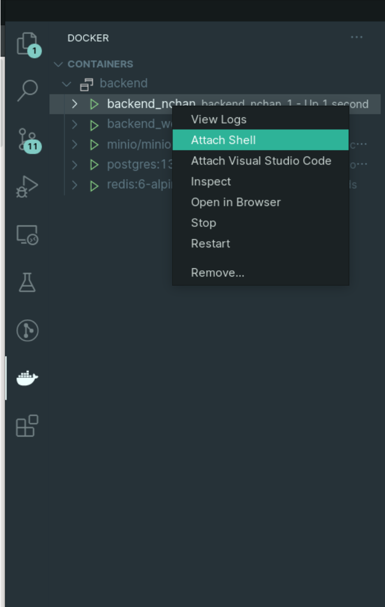
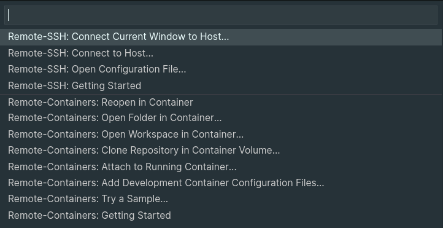

# Cat Food Backend

[](https://codecov.io/gh/TJCatFood/backend/)


## 目录结构

```
.
|─catfood                # Django Project
|   ├─manage.py          # CLI 工具
|   ├─catfood            # Django App，web 入口
|   |    ├─__init__.py   # 标识这是一个 python 包
|   |    ├─asgi.py       # ASGI 兼容支持
|   |    ├─settings.py   # 全局 配置文件，目前为 Debug 模式
|   |    ├─urls.py       # 全局 路由
|   |    ├─views.py      # 本模块 views
|   |    └wsgi.py        # WSGI 兼容
|   |
|   ├─module0
|   ├─module1
|   ├─module2
|   └─module3            # 其他功能模块，和 /catfood/catfood 平级目录,配置作用于本功能模块
|                                                  
├─requirements           # python 依赖目录
|    ├─dev.txt           # 开发环境依赖
|    └─prod.txt          # 生产环境部署依赖
├─Dockerfile.web.dev     # 开发环境 Dockerfile
├─docker-compose.yml     # 开发环境 docker compose 配置
└README.md               # 说明
```

## 如何开始

请先仔细阅读 [**如何获取和提交源码**](https://github.com/TJCatFood/README)

### 配置 Docker 和 Docker Compose

- [如何在 Linux 安装 Docker (TUNA/docker-ce)](https://mirrors.tuna.tsinghua.edu.cn/help/docker-ce/)

- [如何安装 Docker Compose](https://docs.docker.com/compose/install/)

- [清华大学学生网络与开源软件协会 (TUNA) 镜像站](https://mirrors.tuna.tsinghua.edu.cn/)

- [网易 Docker Hub 镜像](https://hub-mirror.c.163.com/)

- [Docker 文档](https://docs.docker.com/)


### 使用 Docker 环境开发

**注意！**
- **不要滥用 sudo**
  - 如果不加 sudo 时使用 docker 出错，你可能需要将当前用户加入 docker 用户组并重启会话
- 在本地开发分支中执行以下操作
- 所有对于 `catfood` 下文件的修改都与本地目录同步
- DB 的数据会持久化存储在 `.persistence` 下，删除请使用

    ```
    # sudo rm -rf .persistence #
    ```
#### 启动 Web 服务器

进入代码根目录，运行

```
USER_ID=`id -u` GROUP_ID=`id -g` MINIO_ADDRESS=<ip of a specific NIC on your host> docker-compose up
```

你可以手动查看自己网卡的 IP

```
ip addr
```

或者使用以下脚本匹配第一个可用网卡的 IP

```
alias myip="ip -4 addr | grep -oP '(?<=inet\s)\d+(\.\d+){3}' | grep -v 127.0.0.1 | head -n 1"
```

```
USER_ID=`id -u` GROUP_ID=`id -g` MINIO_ADDRESS=`myip` docker-compose up
```

不要关闭终端，使用代码编辑器修改代码

在 `http://127.0.0.1:8000` 可以访问 Web API，本地文件保存时会自动刷新服务器

在 docker 的依赖发生变化后（参考 Dockerfile），请重新构建 docker：

```
docker-compose build
```

#### 在 Docker 中运行指令

找到 web 的容器

```
docker ps
```

打开交互 Shell

```
docker exec -it <container name or id> /bin/bash 
```

#### 关闭 Web 服务器

```
docker-compose down
```

了解其他配置可以阅读 `Dockerfile.web.dev` 和 `docker-compose.yml`

### VSCode 使用建议

#### VSCode Docker

[Docker](https://marketplace.visualstudio.com/items?itemName=ms-azuretools.vscode-docker)

##### 打开 Docker 的 Shell



#### VSCode Remote

[Remote - Containers](https://marketplace.visualstudio.com/items?itemName=ms-vscode-remote.remote-containers)

##### Remote Dev in Docker

点击左下角 `><` 图标，选择 Attach to Running Container



## 用户系统使用方式

### 注册用户

预留了 `localhost:8000/api/v1/user/university/` 和 `localhost:8000/api/v1/user/school/` 两个接口来设置大学和学院，在注册用户之前请确认是否有大学和学院（用户的外码）。

对university表进行了修改，现在里面包含三个字段 `university_id`，`official_id`，`university_name` 添加了字段 `official_id`，用于表示官方编号系统对大学的编号。

### 用户鉴权

#### 不需要鉴权(允许任何人访问及使用)：

 - 类形式：

```python
permission_classes = [AllowAny]
```

 - 装饰器形式：

```python
@permission_classes([AllowAny])
```

#### 需要鉴权：

 - 类形式：

```python
authentication_classes = [CatfoodAuthentication]
permission_classes = [IsTeacher|IsChargingTeacher]
```

 - 装饰器形式：

```python
@authentication_classes([CatfoodAuthentication])
@permission_classes([IsTeacher|IsChargingTeacher])
```

这是只允许教师（即普通教师和责任教师）访问的情形，其他以此类推。如果需要更进一步的逻辑判断，可以使用`request.user`获取发起请求的用户。例如`request.user.user_id`可以获得此用户的id。

可选权限类：`[IsStudent|IsTeachingAssistant|IsTeacher|IsChargingTeacher]`
